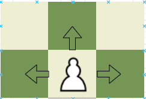
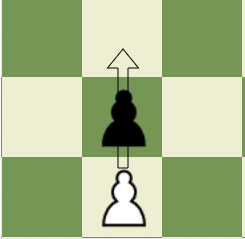
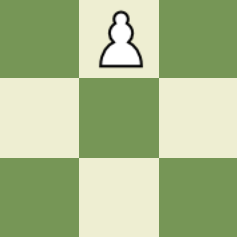
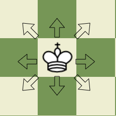

# Turkish Checkers

## Overview

Turkish Checkers is a traditional board game that we developed as a part of a school project by a team of three enthusiastic individuals. This classic game, also known as "Dama" is a two-player strategy game that is widely popular in Turkey and various other countries. Most of the recources for this game were taken by the famouse web game chess.com.

## Rules

The objective of Turkish Checkers is to capture all of your opponent's pieces or block them in such a way that they cannot make any legal moves. The game is played on a 8x8 checkered board, and each player starts with 16 pieces of the same color (either black or white). In this game there are only 2 kind of pieces Soldiers and Kings. There are 16 Soldiers to a side, 8 each on the second and third rows to commence play. The soldiers move to the sides or straight forward but not diagonally or backward. Captures are made by jumping, either to the side or forward; the maximum number of pieces possible must be captured. Pieces are removed one by one when captured. To update a regular soldier to a king you need to reach the enemy base whitch is the first row of the other player. The king can move one square in all possible directions). 

### Moves

   Soldiers Moves

   

   Soldiers Capture
   
    -> 

   King Moves

   

### Capturing

1. If a player has multiple options for capturing, they can choose which piece to capture with, but they must make the most extended sequence of captures.
2. After making a capture, the player can continue to make additional captures with the same piece or a different one if there are other valid capturing moves available.

### Winning

The game ends when:

1. One player captures all of the opponent's pieces.
2. The opponent gives up.

## Installation Guide

As of now, the installation process for Turkish Checkers is manual and straightforward. Follow the steps below to set up the game on your device:

1. Clone this repository.
2. Make sure you have EclipseIDE installed with JavaFX ([Here](https://www.youtube.com/watch?v=mUbORGu-z6Q) is a quick video how to add JavaFX on Ecliplse)
3. Make sure you update the projects library with the JavaFX one.
4. Run the program on Eclipse.

## Note

Turkish Checkers is a work in progress, and we are continuously improving it based on feedback and suggestions. If you encounter any issues or have ideas for enhancing the game, please feel free to reach out to us. Your feedback is valuable to us!

Have fun and enjoy this traditional board game!

